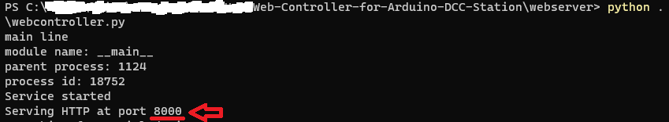
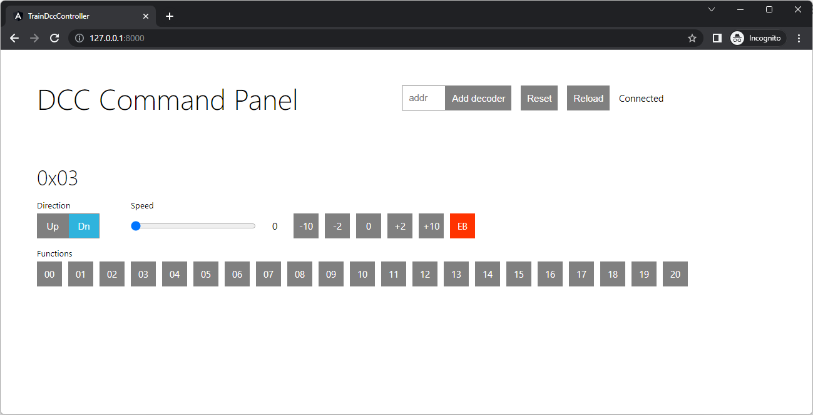

# Web-Controller-for-Arduino-DCC-Station
A Web interface with python script that works with another project [Arduino-DCC-Station](https://github.com/doyleLai/Arduino-DCC-Station). This project comes with a python webserver that provides a web interface and a python script that interacts with the web interface and the mentioned Arduino DCC station using the serial port.

You need to upload the Arduino program [here](https://github.com/doyleLai/Arduino-DCC-Station) to your Arduino board first and connect your computer to the Arduino using a USB cable.

## Important message
I do not have time to write this documentation. No detailed technical information can be provided at this moment. I believe this program is simple to use. Feel free to explore it yourself. You should use the program at your own risk.

## Required Python Modules
- pySerial: `pip install pyserial`
- Websocket Server: `pip install websocket-server`

## Installation
1. Go to this [Arduino-DCC-Station](https://github.com/doyleLai/Arduino-DCC-Station) and follow its procudere to upload the Arduino DCC Station program to your Arduino Board.
1. Keep the USB cable connected to the Arduino Board
1. Download and unzip this project.
1. Go to the `webserver` folder
1. Run: `python webcontroller.py`
1. In the console, note which port the HTTP is serving at. 

1. Open a web browser, go to `127.0.0.1:xxxx` (where `xxxx` is the port number shown in the console). 
**Note:** If the HTTP server fails to start, open `frontend_server.py`, change the `PORT` variable to anohter number such as `8001` or others. Save it and then retry from step 5.
1. Enjoy! 

## Websocket message format and protocol
~~The socket server store the status of locos and broadcast the status to all clients periodically (maybe once every 5 sec). After receiving a change request from a client, the server broadcast the new state of that loco to all clients immediately.~~

### To server
- getLocos: ask server to send back the status of locos immedilately
- addLoco: add a new Loco in the server
- c_speed: change the speed of a loco
- c_fun: change a function state of a loco
- reset: reset the system including the Arduino
### To client
- loco: notifly the current status of a loco
- locos: notifly the current status of locos

Messages are formated in JSON. 
|Type    |Example| 
|--------|-------|
|getLocos|{"type": "getLocos", "data": {}}|
|addLoco |{"type": "addLoco", "data": {"address":3}}                                                               |
|c_speed |{"type": "c_speed", "data": {"address":3, "direction": 0, "speed": 127}}                                 |
|c_fun   |{"type": "c_fun", "data": {"address":3, "function": 10, "isOn": true}}                                   |
|reset   |{"type": "reset", "data": {}}                                                                            |
|loco    |{"type": "loco", "data": {"address":3, "direction": 1, "speed": 0, "functions":[1,0,0,0,...]}}           |
|locos   |{"type": "locos", "data": [{"address":3, "direction": 1, "speed": 0, "functions":[1,0,0,0,...]}, ...]}   |
